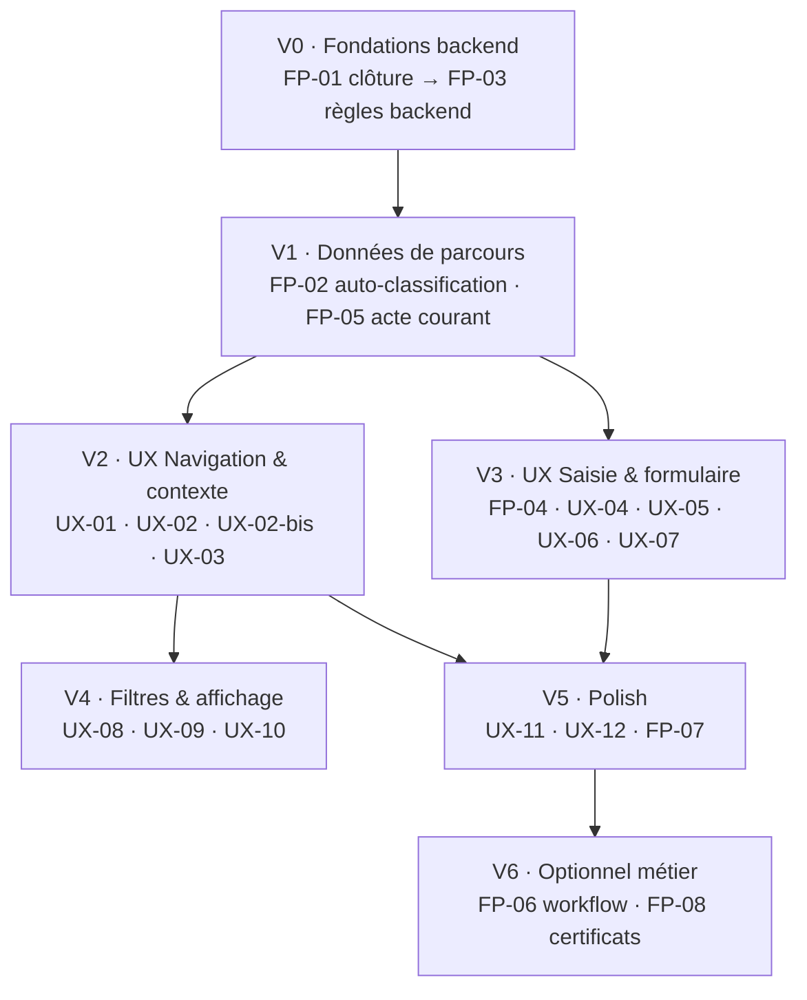

# Plan d'intégration — Corrections module Plan de Carrière

> Consolide les deux backlogs :
> - `docs/AMELIORATIONS_UX_PLAN_CARRIERE.md` → **UX-01 … UX-12**
> - `docs/FONCTIONNALITES_PLAN_CARRIERE.md` → **FP-01 … FP-09**
>
> Objectif : ordonner et regrouper les corrections par **dépendances**, pour une intégration progressive, testable et sans régression.

---

## 1. État d'avancement

| Statut | Items |
|---|---|
| ✅ **V0 terminée** | **FP-01** (clôture auto de tous les plans actifs), **FP-03** (règles métier backend), **FP-09** (échelon dérivé) |
| ⬜ À faire | FP-02, FP-04 … FP-08, UX-01 … UX-12 |

---

## 2. Vagues d'intégration (ordonnées par dépendances)

**Logique** :
- La **clôture correcte (FP-01)** est la fondation : sans elle, la « situation actuelle » est fausse → tout le reste (acte courant, auto-classification, affichage) serait basé sur des données incohérentes.
- **FP-03** (règles backend) s'appuie sur le dernier plan actif (fourni par FP-01) : à faire juste après.
- Les items **UX de contexte** (V2) et **UX de saisie** (V3) dépendent des données fiables de V1.
- Les **filtres** (UX-08) dépendent des colonnes Type/État (UX-02).

---

## 3. Table de correspondance (item → fichiers → validation)

| Item | Backend | Frontend | Dépend de |
|---|---|---|---|
| **FP-01** clôture auto | `Infrastructure/.../CareerPlanDataService.cs` (`GetByEmployeeAndContractType`), `Api/Controllers/career/CareerPlanController.cs` (`Create`) | — | — |
| **FP-03** règles backend | `Application/Services/career_plan/CareerPlanService.cs` (ou `CareerPlanValidator`), `CareerPlanController.cs` (`Create`, `Update`), `Domain/Entities/crud_career/Echelon.cs`, `LegalClass.cs` | — | FP-01 |
| **FP-02** auto-classification | — (endpoint `GET /CareerPlan/last/{matricule}` existe) | `features/career/career-plan-create.page.ts`, `core/career-plan-create.service.ts`, réutilise R1 (`career-advancement-form.component.ts`) | FP-01 |
| **FP-05** acte courant | — | `features/employee/components/employee-career-panel.component.ts` | FP-01 |
| **UX-01** actions de ligne | — (routes existent) | `features/career/career-list.page.ts` | — |
| **UX-02** colonnes Type/État | `Infrastructure/.../CareerPlanDataService.cs` (`GetAllCareersFilter` / vue `v_employee_career` si besoin) | `features/career/career-list.page.ts`, `core/career-plan-list.service.ts` | FP-01 |
| **UX-02-bis** plan courant | — | `career-list.page.ts` | FP-01, FP-05 |
| **UX-03** carte situation actuelle | — (endpoint `GET /CareerPlan/last` existe) | `career-plan-create.page.ts` + `career-plan-edit.page.ts` | FP-01 |
| **FP-04** confirmation remplacement | — | `career-plan-create.page.ts`, `career-plan-edit.page.ts` | UX-03 |
| **UX-04** confirmation changement type | — | `career-plan-create.page.ts` | FP-02 |
| **UX-05** stepper | — | `career-plan-create.page.ts`, `career-plan-edit.page.ts` | — |
| **UX-06** récap erreurs + focus | — | `career-plan-create.page.ts`, `career-plan-edit.page.ts`, `components/career-appointment-form.component.ts`, `career-advancement-form.component.ts` | — |
| **UX-07** toast succès | — | `career-plan-create.page.ts`, `career-plan-edit.page.ts` | — |
| **UX-08** filtres enrichis | `CareerPlanDataService.cs` (`GetAllCareersFilter` : params Type/État) | `career-list.page.ts` | UX-02 |
| **UX-09** explication net | — | `components/career-appointment-form.component.ts` | — |
| **UX-10** alerte RIB actionnable | — | `career-plan-create.page.ts`, `career-plan-edit.page.ts`, `components/career-appointment-form.component.ts` | — |
| **UX-11** onglet courant vs historique | — | `features/employee/components/employee-career-panel.component.ts` | FP-05 |
| **UX-12** selects recherchables | — | `components/career-appointment-form.component.ts`, `career-advancement-form.component.ts` | — |
| **FP-07** timeline | — | `employee-career-panel.component.ts` | UX-11 |
| **FP-06** workflow statut | `Domain/Entities/career_plan/CareerPlan.cs`, `CareerPlanController.cs`, `CareerPlanDataService.cs` | `career-list.page.ts` (badge État) | UX-02 |
| **FP-08** certificats liés | `Domain/Entities/career_plan/CertificateHistory.cs`, `CareerPlanController.cs` (`Certificate/Save`) | fiche acte | — |

---

## 4. Détail des vagues

### V0 · Fondations backend (FP-01 → FP-03)
1. **FP-01** — Modifier `GetByEmployeeAndContractType` pour récupérer le **dernier plan actif** sans filtre `Employee_type_id = 2` (renommer si besoin en « dernier plan actif »). Dans `Create`, clôturer **tout** plan actif de l'employé (`Ending_contract = Assignment_date`), pas seulement un.
   - ⚠️ **Tester le cas CDI** (actuellement non clôturé).
2. **FP-03** — Introduire un validateur backend (R1 indice croissant, R2 échelon↔indice, R3 ancienneté min, R4 reset classe, salaire ≥ min, dates cohérentes). Retour 4xx avec message explicite.

### V1 · Données de parcours (FP-02, FP-05)
3. **FP-02** — À la sélection de l'employé dans la création, appeler `GET /CareerPlan/last/{matricule}` → comparer l'indice → proposer le type par défaut (Avancement si indice ↑) avec badge explicatif. L'utilisateur garde la main.
4. **FP-05** — Dans l'onglet Carrières, marquer le plan actif « Courant » (badge), le trier en tête, ajouter le résumé « Situation actuelle ».

### V2 · UX Navigation & contexte (UX-01, UX-02, UX-02-bis, UX-03)
5. **UX-01** — Boutons Modifier / Détail (+ Clôturer pour actif) par ligne → routes existantes.
6. **UX-02** — Colonnes **Type** (badge) et **État** (badge) ; fournir les données via la liste backend si absentes de la vue.
7. **UX-02-bis** — Mettre en évidence le plan courant (s'appuie sur FP-01/FP-05).
8. **UX-03** — Carte « Situation actuelle » (poste, département, catégorie/classe, salaire, RIB) affichée dès la sélection de l'employé (tous types).

### V3 · UX Saisie & formulaire (FP-04, UX-04 … UX-07)
9. **FP-04 + UX-03** — Encart « Ce plan remplacera et clôturera le plan X (poste Y, au Z) » quand un plan actif existe.
10. **UX-04** — Dialogue de confirmation avant bascule de type si des champs sont remplis (lié à FP-02).
11. **UX-05** — Stepper : 1. Identification · 2. Organisation · 3. Rémunération & Classification · 4. Récapitulatif.
12. **UX-06** — Bandeau « N erreur(s) » + focus/scroll premier champ invalide.
13. **UX-07** — Toast de succès (n° de décision) + redirection fiche employé onglet Carrières.

### V4 · Filtres & affichage (UX-08 … UX-10)
14. **UX-08** — Filtres Type + État dans la liste (backend `GetAllCareersFilter`), libellés Du/Au sur les dates.
15. **UX-09** — Hint « Net estimé = base × (1 − taux de charges) » + taux appliqué.
16. **UX-10** — Alerte RIB visible + lien « Saisir le RIB ».

### V5 · Polish (UX-11, UX-12, FP-07)
17. **UX-11** — Onglet Carrières : section « Affectation actuelle » + historique.
18. **UX-12** — Bascule en `gcc-searchable-select` pour les listes longues.
19. **FP-07** — Timeline chronologique du parcours.

### V6 · Optionnel métier (FP-06, FP-08)
20. **FP-06** — Workflow Brouillon → Validé → Effectif → Clôturé (+ `Validated_by`/`Validated_date`).
21. **FP-08** — `Career_plan_id` sur `CertificateHistory` + rattachement à l'acte.

---

## 5. Stratégie de validation

| Étape | Commande | Attendu |
|---|---|---|
| Build backend | `dotnet build BACKEND\SoftGcc.sln` | 0 erreur (⚠️ arrêter le process `SoftGcc.Api` d'abord : DLL verrouillées) |
| Tests backend | `dotnet test BACKEND\SoftGcc.sln` | 100 % vert (68 tests) |
| Build frontend | `cd frontend; npm run build` | OK (avertissements CommonJS préexistants tolérés) |
| Smoke test UI | Navigation liste → création (3 types) → fiche employé Carrières | Parcours complet sans console error |

**Tests ciblés à ajouter** (au fil des vagues) :
- FP-01 : création d'un plan pour un CDI → l'ancien plan est clôturé.
- FP-03 : `POST /CareerPlan` avec indice non croissant → 4xx.
- FP-09 : nomination → `echelonId` renseigné (déjà couvert par le formulaire).

---

## 6. Risques & points d'attention

| Risque | Mitigation |
|---|---|
| **SQL Server injoignable** (`dotnet run` échoue) | Vérifier le service SQL, aligner la chaîne de connexion (`appsettings.Windows.json` vs `appsettings.json`) |
| **DLL verrouillées** pendant `dotnet build` | `Get-Process -Name SoftGcc* \| Stop-Process -Force` avant build |
| **Vue `v_employee_career`** incomplète (pas de Type/État) | Ajouter les colonnes dans la vue ou enrichir `GetAllCareersFilter` (ne pas casser les vues dépendantes) |
| **Règle « un seul plan actif »** mal appliquée | Valider FP-01 d'abord ; toute la logique de situation actuelle en dépend |
| **Régression sur les vues/triggers** (module évaluations récemment touché) | Ne pas modifier les fichiers `bdd/eval/*` dans ce plan ; vérifier les dépendances de vues |

---

## 7. Récapitulatif d'exécution

| Vague | Items | Effort estimé | Critère de sortie |
|---|---|---|---|
| V0 | FP-01, FP-03 | M | Backend build + tests verts, clôture CDI validée |
| V1 | FP-02, FP-05 | M | Type proposé par défaut + acte courant affiché |
| V2 | UX-01, UX-02, UX-02-bis, UX-03 | M | Liste actionnable + contexte employé visible |
| V3 | FP-04, UX-04, UX-05, UX-06, UX-07 | L | Saisie guidée, sécurisée, feedback clair |
| V4 | UX-08, UX-09, UX-10 | S | Filtres + transparence calculs |
| V5 | UX-11, UX-12, FP-07 | S | Confort de lecture |
| V6 | FP-06, FP-08 | L (selon besoin) | Workflow / certificats |

> **Recommandation** : livrer vague par vague (chaque vague finit par `dotnet test` + `npm run build` + smoke test), en commençant par **V0**.
